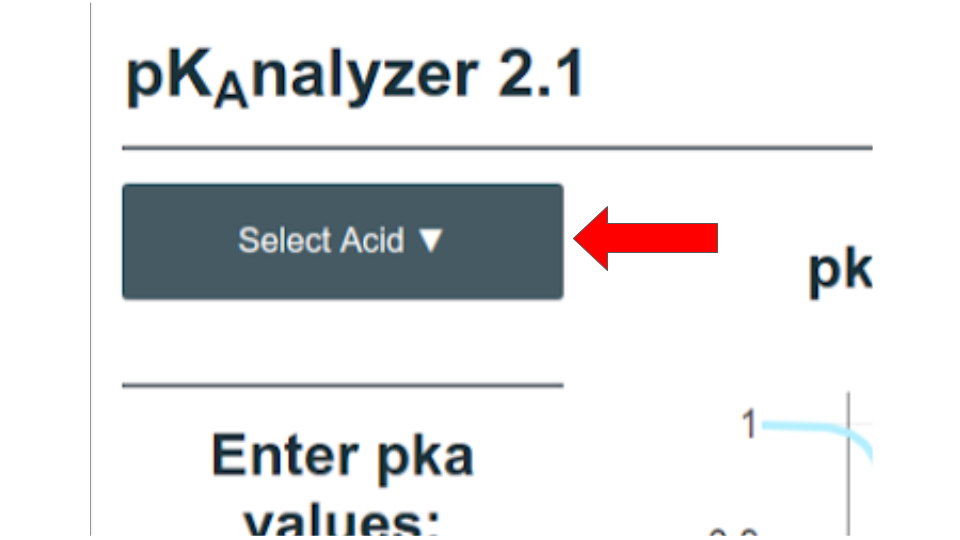
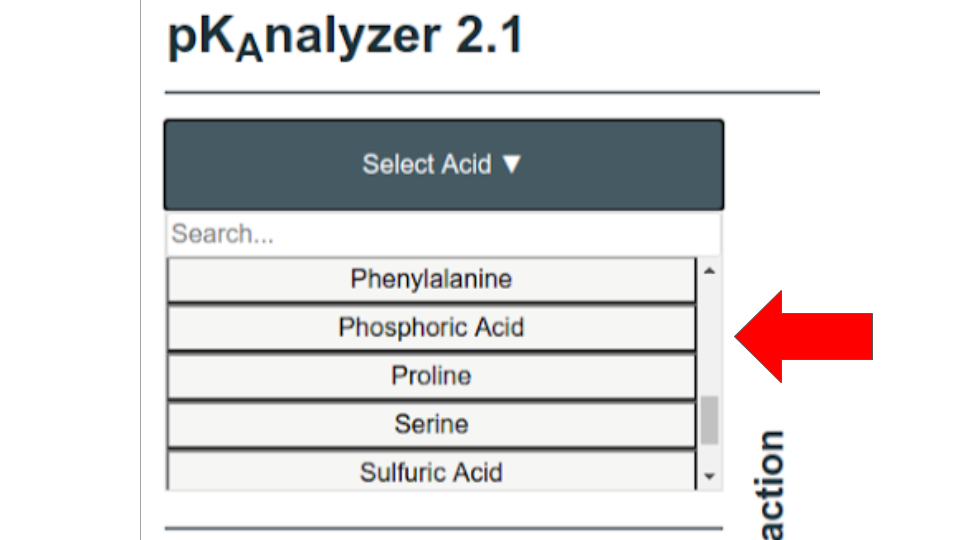
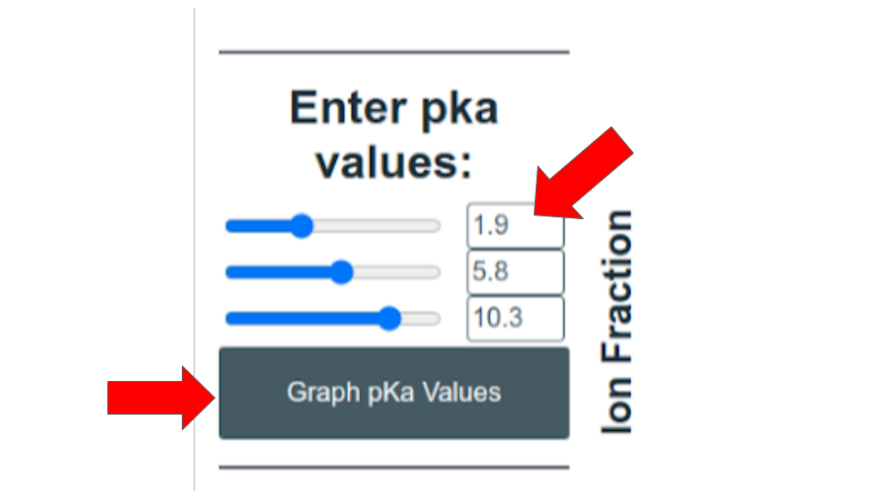
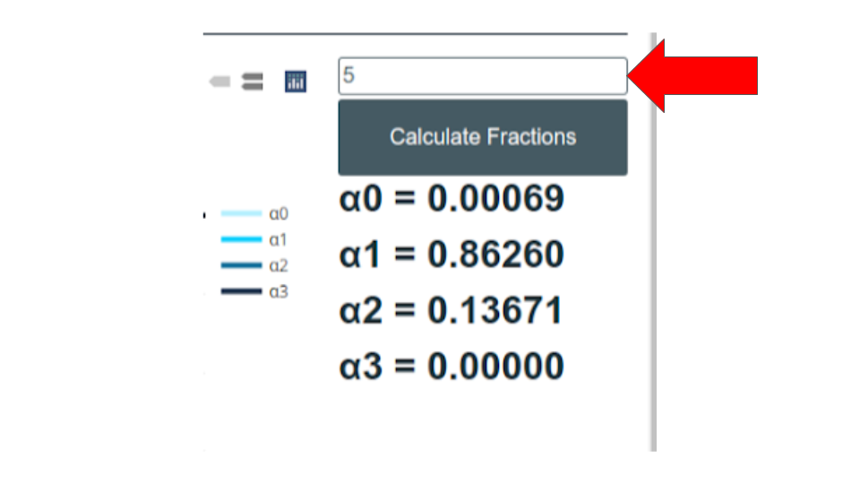
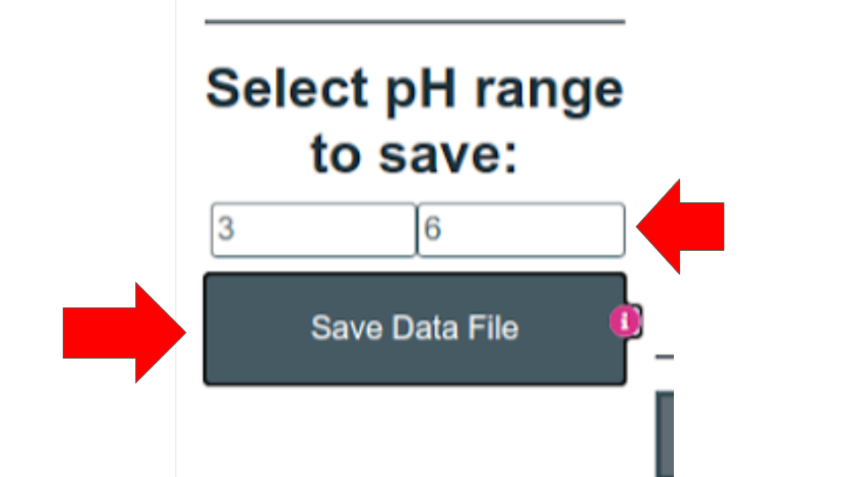

# pKAnalyzer 2.1

## Purpose

This project was funded by Virginia Tech’s Institute for Creativity, Arts and Technology (ICAT) and overseen by Professors Andrea Dietrich of Civil and Environmental Engineering and Anne Brown of Biochemistry and University Libraries. This product is a web application able to calculate the ionization fractions of any acid at any pH range. In addition, it plots the ionization fractions of the acid within the pH range that those fractions are changing. The motivation behind this project was to provide an accessible and user friendly tool to help students and researchers visualize acid ion distributions. This application will be available Fall 2019 to students in the following Virginia Tech Courses: CEE 5104 Environmental Chemistry (Instructors: Dietrich and Godrej), CEE 3104 Intro to Environmental Engineering (Instructors: Dietrich and others), and in 2020 to students in GEOS 5834 Chemical Hydrogeology (Instructor: Schreiber). 

***

## Introduction

The acid being analyzed can be selected from a list of common acids and amino acids (last updated 9/10/20). If the acid in question is not on the list, the user can also manually enter in any set of pKa values. Instructions for both of these methods are listed below. Ionization fractions can be calculated at any specific pH or across a range of pH values and the results saved to a text file. This user guide will first explain how to enter acids using the searchable dropdown and pKa text-fields. Second, it will go over how to calculate ionization fractions at any pH value for a particular acid. Finally, it will demonstrate how to save ionization fraction values for a particular acid over a user-specified range of pH values. We hope that you will find this a useful tool for both academic and research purposes. 

### Key Terms

- **pH** - Measure of acidity of a solution. Generally, 0 is considered most acidic and 14 is least acidic (most basic); however, values beyond this range are possible. For reference, the pH human blood must be within the narrow range of 7.35-7.45.
- **pKa** - a measure of the strength of a particular acid. The lower the pKa of an acid, the more drastically it will lower the pH of a solution it is added to.
- **Ionization fraction** - The fraction of acid molecules that have ionized to a particular state (lost a particular number of protons).
- **Amino acids** - a special group of 20 amphoteric acids that are the building blocks of proteins. The general structure of an amino acid consists of a basic amino group (−NH2), an acidic carboxyl group (-COOH), and an R group (or side chain) that is unique to each amino acid.

***

## Usage

This web application is intended to provide an accessible and user friendly tool to help students and researchers visualize acid ion distributions. There are two methods of entering pKa values. The first is selecting one of the common acids from the dropdown menu by clicking the “Select Acid” button. The second method is by entering the pKa values manually in the pKa1, pKa2 and pKa3 text fields and clicking the “Graph pKa values” button. If the acid does not have 3 pKa values, leave any unused pKa value text fields blank. 

### Method A (Select Acid dropdown menu)
1. Click "Select Acid" Button
    
2. Click the acid you want to analyze
    
### Method B (Enter pKa values manually)
1. Enter the pKa(s) of your acid into the appropriate text-fields.
2. Click “Graph pKa Values”.
    
### Calculate Ion Fractions at a specific pH
Once you have selected and graphed an acid, you can calculate the ion fractions at any specific pH by:

1.Entering the pH value into the “Enter pH” text field.
2.Clicking the “Calculate Fractions” button.

### Save Ionization Fractions Text File
The ion fractions will be calculated at every pH value in between the starting and final value (inclusive) incremented by 0.1.

1. Enter the starting pH value and ending pH value and in the “start” and “final” text fields.
2. Click the “Save Data File” which will download a text file. 

***

## Acknowledgments
The pKAnalyzer has been made possible in part by a grant from Virginia Tech’s Institute for Creativity, Arts, and Technology and in-kind contributions from the University Libraries. 

The following people at Virginia Tech contributed to this project:

- Andrea M. Dietrich, Principal Investigator, Department of Civil & Environmental Engineering
- Anne M. Brown, Co-Investigator. Department of Biochemistry and University Libraries
- Jonathan Briganti, University Libraries
- Conor Gallagher, Department of Civil & Environmental Engineering
- Adil Godrej, Department of Civil & Environmental Engineering
- Conor Kelly, Department of Chemistry, Computer Science
- Madeline Schreiber, Department of Geosciences
- Tanner Spicer, Academy of Integrated Science, Computer Science, University Libraries 
- Michael Stamper, University Libraries
- Anita R. Walz, University Libraries

### References 
Snoeyink, Vernon L. and Jenkins, David (1980). Chapter 4, table 4-1.”Acidity and Basicity Constants for Substances in Aqueous Solution at 25 degrees C.” in Water Chemistry; p.90-91. Wiley: New York.

### Disclaimer
The authors and Virginia Tech make no representations or warranties of any kind, expressed or implied, including but not limited to the implied warranties of merchantability and fitness for a particular purpose, regarding the information contained in or generated by this software or the software itself.. The authors and Virginia Tech do not assume any liability to any part for loss, damage, or disruption caused by errors or omissions, whether such errors or omissions result from negligence, accident, or any other cause. In no event will the authors or Virginia Tech be liable for any loss or damage including without limitation, indirect or consequential or damage, or and loss or damage whatsoever arising from use of this software. Users of this program assume all risks and further agree to hold Virginia Tech and the Commonwealth of Virginia and their employees and agents harmless from any and all actions related to use of this program.

### How To Cite
Dietrich, A., Brown, A., Briganti, J., Gallagher, C., Godrej, A., Kelly, C., Schreiber, M., Stamper, M., and Walz, A. (2019) pKAnalyzer 2.0. https://databridgevt.github.io/pka-analyzer. Released under GPL v2.0. 
